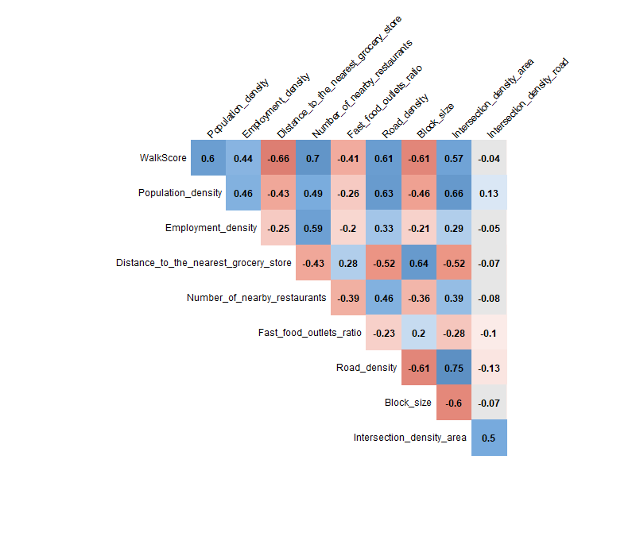

```{r setup, include=FALSE}
knitr::opts_chunk$set(echo = TRUE)
```

```{r include=FALSE}
library(sf)
library(tmap)
library(tictoc)
library(tidyverse)
library(magrittr)
library(tidycensus)
library(lehdr)
library(jsonlite)
library(httr)
library(zoo)
library(viridis)
library(hrbrthemes)
library(scales)
library(grid)
library(gridExtra)
library(dendextend)
library(mlogit)
library(osmdata)
library(corrplot)
library(nFactors)
library(tigris)
library(knitr)
library(showtext)
library(formattable)
library(kableExtra)
library(huxtable)
library(reticulate)

font_add_google(name = 'Raleway', family = 'Raleway')
custom.color <- c("#a05195","#f95d6a","#ffa600")
```


```{r dataload1, include=FALSE}
temp.wd <- paste0(Sys.getenv('USERPROFILE'),
             '/Dropbox (GaTech)/_Research/eating_habit_covid_19/code')
setwd(temp.wd)

load('restaurant_poi&visitor.RData')
# city vs. suburb
city <- places(state = 'GA') %>% 
  filter(LSAD == 25)

poi.r.city <- poi.r.sf[city,] %>% 
  mutate(in.city = 1) %>% 
  select(placekey, in.city)

file.restaurant %<>% left_join(poi.r.city %>% st_set_geometry(NULL), by = 'placekey')
file.restaurant$in.city[is.na(file.restaurant$in.city)] <- 0
```

```{r dataload2, include = FALSE}
setwd(temp.wd)

# covid cases
covid.case <- read.csv(file = 'data_table_for_daily_case_trends__the_united_states_2022may.csv')
covid.case %<>% mutate(date = as.Date(covid.case$Date, format = c('%b %d %Y')))
covid.case %<>% mutate(cases_2wk.ma = rollmean(New.Cases, k = 14, fill = NA, align = 'center'))

covidCaseViz <- function(left.y.axis, val) {
  list(geom_ribbon(data = covid.case, aes(date, ymax = cases_2wk.ma*val/800000, ymin = 0, fill = 'Covid cases'),
                   alpha = 0.5, lwd = 0.4),
       scale_fill_manual(values = '#6b6b6b'),
       scale_y_continuous(
         name = left.y.axis,
         labels = scales::comma_format(digits = 0),
         sec.axis = sec_axis(trans = ~./val*800000, name = 'Covid cases (US)', labels = scales::comma_format(digits = 0)),
         expand = c(0, 0)))}

covidCaseVizPct <- function(left.y.axis, val) {
  list(geom_ribbon(data = covid.case, aes(date, ymax = cases_2wk.ma*val/800000, ymin = 0, fill = 'Covid cases'),
                   alpha = 0.5, lwd = 0.4),
       scale_fill_manual(values = '#6b6b6b'),
       scale_y_continuous(
         name = left.y.axis,
         labels = scales::percent_format(accuracy = 1),
         breaks = seq(0, 1.1, by = 0.1),
         sec.axis = sec_axis(trans = ~./val*800000, name = 'Covid cases (US)', labels = scales::comma_format(digits = 0)),
         expand = c(0, 0)))}

theme_saved <- list(theme(plot.title = element_text(hjust = 0.5, size=15, family = 'Raleway', color = '#828282'),
                         axis.title.y = element_text(size=14, family = 'Raleway', color = '#828282', margin = margin(r=7)),
                         axis.title.x = element_blank(),
                         axis.text = element_text(size=12, family = 'Raleway', color = '#828282'),
                         axis.title.y.right = element_text(size=14, family = 'Raleway', color = '#828282', 
                                                           margin = margin(l=7)),
                         panel.border = element_blank(),
                         panel.background = element_rect(fill='transparent', color=NA),
                         plot.background = element_rect(fill='transparent', color=NA),
                         panel.grid.major = element_line(color='#787878', linetype = 'dotted', size = 0.2),
                         panel.grid.minor = element_line(color='#787878', linetype = 'dotted', size = 0.2),
                         legend.background = element_rect(fill='transparent', color=NA),
                         legend.box.background = element_rect(fill='transparent', color=NA),
                         legend.position = 'bottom',
                         legend.text = element_text(size=14, family = 'Raleway', color = '#828282'),
                         legend.key = element_blank(),
                         legend.title = element_blank()))
```

```{r data_overview_table}
kable(cbind(file.restaurant %>% 
             select(-date_range_start_yymm, -date_range_end_yymm, -visitor_home_bg,
                    -dwell.10.down, -dwell.20.down, -dwell.60.down, -dwell.60.up),
            file.restaurant %>% select(visitor_home_bg)) %>% .[5:7,], format = "simple", row.names = F)
```

```{r tag_example}
rownames(file.restaurant) <- NULL
tag_example <- file.restaurant %>% 
  select(name, category_tag) %>% 
  filter(str_detect(name, 'Dunkin|Burger King|Salata')) %>% 
  .[duplicated(.) == F,]

kable(tag_example, format = "simple", row.names = F)
```

```{r tags_in_tag}
all.tags <- poi.r$category_tag
time_tag <- c('Breakfast', 'Brunch', 'Lunch', 'Dinner', 'Late Night')
place_tag <- c('Counter Service', 'Take Out and Delivery Only', 'Drive Through', 
              'Catering', 'Casual Dining', 'Buffet', 'Diner', 'Truck or Cart', 
              'Cafeteria', 'Bar or Pub', 'Fine Dining', 'Sports Bar', 'Wine Bar')

three.tags <- c('Snacks|Dessert', 'Fast Food', 'Healthy Food')

tagExamine <- function(tag_name){
  temp <- all.tags[str_detect(all.tags, tag_name)]
  total.num <- length(temp)
  
  temp %<>% lapply(function(x) {str_split(x, ',')}) %>% 
    unlist() %>% 
    .[!str_detect(., 'Snacks|Dessert|Fast Food|Healthy Food')] %>% 
    as.data.frame()

  colnames(temp) <- 'tag'
  temp %<>% filter(!tag %in% c(time_tag, place_tag)) %>% 
    group_by(tag) %>% 
    summarize(frequency=n()/total.num)
  
  temp$frequency <- formattable::percent(temp$frequency, digits = 0)
  temp <- temp[order(-temp$frequency),]
  return(head(temp, 10))
}

tag_freq <- cbind(tagExamine(three.tags[1]),
                  tagExamine(three.tags[2]),
                  tagExamine(three.tags[3]))

colnames(tag_freq) <- c('Snacks & Dessert', 'Freq.', 'Fast-food', 'Freq.', 'Healthy Food', 'Freq.')

kable(tag_freq, format = "simple", row.names = F, align = c('l','r','l','r','l','r'))
```


```{r total_visit, fig.height = 7, fig.width = 10, dev.args = list(bg = 'transparent'), warning = FALSE, message=FALSE}
# total visitor trend
total.trend <- file.restaurant %>%
  group_by(date_range_end) %>%
  summarize(visit_counts = sum(visit_counts)) %>%
  mutate(date = as.Date(date_range_end)) %>% 
  mutate(visit_counts_2wk.ma = 
           rollmean(visit_counts, k = 2, fill = NA, align = 'center'))

p <- ggplot() + 
  covidCaseViz('Visit counts', max(total.trend$visit_counts_2wk.ma, na.rm = T)) +
  geom_line(data = total.trend, aes(date, visit_counts_2wk.ma, color = 'Restaurant Visits'), lwd = 1) +
  ggtitle('Total restaurant visit counts') +
  scale_color_manual(values = c(custom.color[1])) +
  scale_x_date(date_breaks = '3 months', date_labels = "%b`%y", expand = c(0, 0)) +
  theme_bw() +
  theme_saved

#ggsave('img/plot1.png', p, bg = 'transparent', width = 10, height = 7)
```


```{r take_out_dine_in, fig.height = 7, fig.width = 10, dev.args = list(bg = 'transparent'), warning = FALSE}
# take-out vs. dine-in
file.restaurant %<>% mutate(take.out = dwell.10.down + dwell.20.down,
                     dine.in = dwell.60.down + dwell.60.up)

dwell.time2 <- file.restaurant %>%
  group_by(date_range_end) %>%
  summarize(across(c('take.out', 'dine.in'), sum)) %>%
  mutate(date = as.Date(date_range_end)) %>%
  pivot_longer(cols = c('take.out', 'dine.in'), names_to = 'dwell_time', values_to = 'visit_counts')

take.out <- dwell.time2 %>% 
  filter(dwell_time == 'take.out') %>% 
  mutate(visit_counts_2wk.ma = rollmean(visit_counts, k = 2, fill = NA, align = 'center'))

dine.in <- dwell.time2 %>% 
  filter(dwell_time == 'dine.in') %>% 
  mutate(visit_counts_2wk.ma = rollmean(visit_counts, k = 2, fill = NA, align = 'center'))

# comparison to July 2019
temp.mean <- mean(take.out$visit_counts_2wk.ma
                  [str_detect(take.out$date_range_end, '2019-07')])
take.out %<>% mutate(visit_counts_2wk.ma.bench = visit_counts_2wk.ma/temp.mean)

temp.mean <- mean(dine.in$visit_counts_2wk.ma
                  [str_detect(dine.in$date_range_end, '2019-07')])
dine.in %<>% mutate(visit_counts_2wk.ma.bench = visit_counts_2wk.ma/temp.mean)

take.out.dine.in <- rbind(take.out %>% mutate(type = 'Take-out'), 
                          dine.in %>% mutate(type = 'Dine-in'))

ggplot() +
  covidCaseVizPct('Benchmarked value', max(take.out$visit_counts_2wk.ma.bench, na.rm = T)) +
  geom_line(data = take.out.dine.in, 
            aes(date, visit_counts_2wk.ma.bench, col = type), lwd = 1) +
  scale_color_manual(values = c(custom.color[1], custom.color[2])) + 
  scale_x_date(date_breaks = '3 months', date_labels = "%b`%y", expand = c(0, 0)) +
  ggtitle('Take-out & Dine-in visit counts (compared to July 2019)') +
  theme_bw() + 
  theme_saved

```


```{r before_during_summary}
restaurant.before.covid <- file.restaurant %>% 
  filter(date_range_start_yymm %in% c('2019-07','2019-08','2019-09',
                                      '2019-10','2019-11','2019-12'))

restaurant.during.covid <- file.restaurant %>% 
  filter(date_range_start_yymm %in% c('2021-07','2021-08','2021-09',
                                      '2021-10','2021-11','2021-12'))

bv <- restaurant.before.covid$visit_counts
dv <- restaurant.during.covid$visit_counts
btv <- restaurant.before.covid$take.out
dtv <- restaurant.during.covid$take.out

##### visit count change and take-out ratio
summary <- data.frame(visit.before = paste(format(round(sum(bv)/1e6, 2), trim = T), 'million'), 
                      visit.during = paste(format(round(sum(dv)/1e6, 2), trim = T), 'million'), 
                      visit.change = formattable::percent(sum(dv)/sum(bv) - 1, digits = 1), 
                      take.out.before = formattable::percent(sum(btv)/sum(bv), digits = 1),
                      take.out.during = formattable::percent(sum(dtv)/sum(dv), digits = 1))

colnames(summary) <- c('Visits before Covid-19', 'Visits during Covid-19', 'Relative change in visits', 
                       'Take-out ratio before Covid-19', 'Take-out ratio during Covid-19')

kable(summary, format = "simple", row.names = F)
```


```{r three_tag_summary}

time <- c('Breakfast', 'Brunch', 'Lunch', 'Dinner', 'Late Night')
place <- c('Counter Service', 'Take Out and Delivery Only', 'Drive Through', 
           'Catering', 'Casual Dining', 'Buffet', 'Diner', 'Truck or Cart', 
           'Cafeteria', 'Bar or Pub', 'Fine Dining', 'Sports Bar', 'Wine Bar')
food <- c('American Food', 'Asian Food', 'Bagel Shop', 'Bakery', 'BBQ and Southern Food',
          'Bubble Tea Shop', 'Burgers', 'Cajun and Creole Food', 'Caribbean Food',
          'Chicken Wings', 'Chinese Food', 'Cocktail Lounge', 'Coffee Shop',
          'Deli', 'Dessert', 'Donut Shop', 'Drinks', 'Fast Food', 'Fried Chicken',
          'Healthy Food', 'Hot Dogs', 'Ice Cream Shop', 'Indian Food', 'Italian Food',
          'Japanese Food', 'Korean Food', 'Latin American Food', 'Mediterranean Food',
          'Mexican Food', 'Pizza', 'Salad', 'Sandwich Shop', 'Seafood','Smoothie & Juice Bar',
          'Snacks', 'Soup', 'Steak House', 'Sushi', 'Tapas', 'Tea House', 'Thai Food',
          'Vegetarian Food', 'Vietnamese Food')
  
visitByTag <- function(file.restaurant) {
  tag <- lapply(unique(file.restaurant$category_tag), function(x) {str_split(x, ',')}) %>% 
    unlist() %>% 
    unique() %>% 
    sort() %>% 
    .[2:length(.)]
  
  total.visit.by.tag <- data.frame(tag = tag, visit.before = NA, visit.before.take.out = NA,
                                   visit.during = NA, visit.during.take.out = NA)
  
  for (i in 1:nrow(total.visit.by.tag)) {
    
    temp1 <- restaurant.before.covid %>% filter(str_detect(category_tag, tag[i]))
    temp2 <- restaurant.during.covid %>% filter(str_detect(category_tag, tag[i]))
    
    total.visit.by.tag$visit.before[i] <- sum(temp1$visit_counts)
    total.visit.by.tag$visit.before.take.out[i] <- sum(temp1$take.out)
    total.visit.by.tag$visit.during[i] <- sum(temp2$visit_counts)
    total.visit.by.tag$visit.during.take.out[i] <- sum(temp2$take.out)
  }

  total.visit.by.tag %<>% mutate(visit.before.take.out.ratio = round(visit.before.take.out/visit.before, 3),
                                 visit.during.take.out.ratio = round(visit.during.take.out/visit.during, 3),
                                 change.rate = round(visit.during/visit.before - 1, 3),
                                 visit.before.share = round(visit.before/sum(visit.before), 3))
  
  total.visit.by.tag %<>% mutate(tag.type = case_when(
    tag %in% time ~ 'time',
    tag %in% place ~ 'place',
    tag %in% food ~ 'food',
    TRUE ~ NA_character_))

  return(total.visit.by.tag)
}

total.visit.by.tag <- visitByTag(file.restaurant)

snack.dessert.visit <- total.visit.by.tag %>% 
  filter(tag %in% c('Snacks', 'Dessert')) %>% 
  select(tag, visit.before, visit.during, visit.before.take.out, visit.during.take.out)

snack.dessert.visit %<>% group_by() %>% 
  summarize(visit.before = sum(visit.before),
            visit.during = sum(visit.during),
            visit.before.take.out = sum(visit.before.take.out),
            visit.during.take.out = sum(visit.during.take.out)) %>% 
  mutate(tag = 'Snack & Dessert',
         change.rate = round(visit.during/visit.before - 1, 3),
         visit.before.take.out.ratio = round(visit.before.take.out/visit.before, 3),
         visit.during.take.out.ratio = round(visit.during.take.out/visit.during, 3)) %>% 
  select(tag, visit.before, visit.during, change.rate,
         visit.before.take.out.ratio, visit.during.take.out.ratio)

fast.healthy.visit <- total.visit.by.tag %>% 
  filter(tag %in% c('Fast Food', 'Healthy Food')) %>% 
  select(tag, visit.before, visit.during, change.rate,
         visit.before.take.out.ratio, visit.during.take.out.ratio)

three.tag.visit <- rbind(snack.dessert.visit, fast.healthy.visit) %>% 
  mutate(visit.before = paste(format(round(visit.before/1e6, 2), trim = T), 'million'), 
         visit.during = paste(format(round(visit.during/1e6, 2), trim = T), 'million'), 
         change.rate = formattable::percent(change.rate, digits = 1), 
         visit.before.take.out.ratio = formattable::percent(visit.before.take.out.ratio, digits = 1),
         visit.during.take.out.ratio = formattable::percent(visit.during.take.out.ratio, digits = 1))
   
colnames(three.tag.visit) <- c('Tag', 'Visits before Covid-19', 'Visits during Covid-19', 'Relative change in visits', 
                       'Take-out ratio before Covid-19', 'Take-out ratio during Covid-19')

three.tag.visit %>% 
  mutate(`Relative change in visits` = color_text("#5765ff", "#ff6363")(`Relative change in visits`), 
         `Take-out ratio before Covid-19` = color_text("#5765ff", "#ff6363")(`Take-out ratio before Covid-19`), 
         `Take-out ratio during Covid-19` = color_text("#5765ff", "#ff6363")(`Take-out ratio during Covid-19`)) %>% 
kable(format = "html", escape = F, align = c("l","r","r","r","r","r"), row.names = F) %>% 
  kable_styling("hover", full_width = T)
```


```{r all_summary}
total.visit.by.tag.food <- total.visit.by.tag %>% filter(tag.type == 'food')
total.visit.by.tag.food %<>% select(tag, visit.before, visit.during, change.rate, 
                                    visit.before.take.out.ratio, visit.during.take.out.ratio)

total.visit.by.tag.food <- total.visit.by.tag.food[order(total.visit.by.tag.food$change.rate, decreasing = T),]

total.visit.by.tag.food %<>% mutate(
  visit.before = formattable::comma(visit.before, digits = 0),
  visit.during = formattable::comma(visit.during, digits = 0),
  change.rate = formattable::percent(change.rate, digits = 0),
  visit.before.take.out.ratio = formattable::percent(visit.before.take.out.ratio, digits = 0),
  visit.during.take.out.ratio = formattable::percent(visit.during.take.out.ratio, digits = 0),
  
)

total.visit.by.tag.food.vis <- total.visit.by.tag.food

colnames(total.visit.by.tag.food.vis) <- c('Tag', 'Visits before Covid-19', 'Visits during Covid-19', 
                                       'Relative change in visits', 
                                       'Take-out ratio before Covid-19', 'Take-out ratio during Covid-19')

total.visit.by.tag.food.vis %>% 
  mutate(`Relative change in visits` = color_text("#5765ff", "#ff6363")(`Relative change in visits`), 
         `Take-out ratio before Covid-19` = color_text("#5765ff", "#ff6363")(`Take-out ratio before Covid-19`), 
         `Take-out ratio during Covid-19` = color_text("#5765ff", "#ff6363")(`Take-out ratio during Covid-19`)) %>% 
  kable("html", escape = F, align = c("l","r","r","r","r","r"), row.names = F) %>% 
  kable_styling("hover", full_width = T, font_size = 14)

```


```{r summary_by_income_and_race, warning=FALSE, message=FALSE, results='hide'}
counties <- c("Fulton","Gwinnett","Cobb","DeKalb","Clayton"
              ,"Cherokee","Forsyth","Henry","Paulding","Coweta","Douglas","Fayette",
              "Carroll","Newton","Bartow","Walton","Rockdale","Barrow",
              "Spalding","Pickens","Haralson","Dawson","Butts",
              "Meriwether","Morgan","Pike","Lamar","Jasper","Heard")

census.sf <- get_acs('block group',
                     variables = c(income = 'B19013_001',
                                   pop = 'B01003_001',
                                   white = 'B02001_002',
                                   median.age = 'B01002_001'),
                     year = 2019,
                     county = counties,
                     geometry = TRUE,
                     state = "GA",
                     output = "wide")

census.sf %<>% mutate(income = incomeE,
                      minority = (popE-whiteE)/popE,
                      median.age = median.ageE) %>%
  select(geo.id = GEOID, income, minority, median.age) %>%
  mutate(income.cate = case_when(
    is.na(income) ~ NA_character_,
    income < 40000 ~ '1. 40,000 or less',
    income < 100000 ~ '2. 40,000-100,000',
    TRUE ~ '3. 100,000 or more')) %>%
  mutate(minority.cate = case_when(
    is.na(minority) ~ NA_character_,
    minority < 0.3 ~ '1. 0-30%',
    minority < 0.7 ~ '2. 30-70%',
    TRUE ~ '3. 70-100%')) %>%
  mutate(age.cate = case_when(
    is.na(median.age) ~ NA_character_,
    median.age <= 35 ~ '1. -35',
    median.age <= 45 ~ '2. 35-45',
    TRUE ~ '3. 45-'))

census <- census.sf %>% st_set_geometry(NULL)
poi.r.sf %<>% st_join(census.sf)
file.restaurant %<>% left_join(poi.r.sf %>%
                                 st_set_geometry(NULL) %>%
                                 select(placekey, geo.id), by = 'placekey')
setwd(temp.wd)
load('visits_list_long.RData')

visit.before.covid <- visits.list.long %>%
  filter(str_detect(date_range_start,
                    '2019-07|2019-08|2019-09|2019-10|2019-11|2019-12')) %>%
  group_by(placekey, home_bg) %>%
  summarize(visit.before = sum(visitor))

visit.during.covid <- visits.list.long %>%
  filter(str_detect(date_range_start,
                    '2021-07|2021-08|2021-09|2021-10|2021-11|2021-12')) %>%
  group_by(placekey, home_bg) %>%
  summarize(visit.during = sum(visitor))


visit.before.covid %<>% left_join(census, by = c('home_bg' = 'geo.id'))
visit.during.covid %<>% left_join(census, by = c('home_bg' = 'geo.id'))

visit.before.covid %<>% drop_na()
visit.during.covid %<>% drop_na()

visit.before.covid %<>% left_join(poi.r %>% select(placekey, category_tag), by = 'placekey')
visit.during.covid %<>% left_join(poi.r %>% select(placekey, category_tag), by = 'placekey')

visit.before.covid %<>% as.data.frame()
visit.during.covid %<>% as.data.frame()

income.cate <- sort(unique(visit.before.covid$income.cate))
minority.cate <- sort(unique(visit.before.covid$minority.cate))
age.cate <- sort(unique(visit.before.covid$age.cate))

total.visit.by.tag.by.group.empty <- data.frame(
  tag = rep(food, each = length(income.cate)*length(minority.cate)*length(age.cate)),
  income.cate = rep(rep(income.cate, each = length(minority.cate)*length(age.cate)),
                    times = length(food)),
  minority.cate = rep(rep(minority.cate, each = length(income.cate)),
                      times = length(food)*length(age.cate)),
  age.cate = rep(age.cate, times = length(income.cate)*length(minority.cate)*length(food)))


for (i in 1:length(food)) {

  temp1 <- visit.before.covid %>% filter(str_detect(category_tag, food[i])) %>%
    group_by(income.cate, minority.cate, age.cate) %>%
    summarize(visit.before = sum(visit.before)) %>%
    mutate(tag = food[i]) %>%
    as.data.frame()

  temp2 <- visit.during.covid %>% filter(str_detect(category_tag, food[i])) %>%
    group_by(income.cate, minority.cate, age.cate) %>%
    summarize(visit.during = sum(visit.during)) %>%
    mutate(tag = food[i]) %>%
    as.data.frame()

  temp3 <- total.visit.by.tag.by.group.empty %>%
    left_join(temp1, by = c('tag', 'income.cate', 'minority.cate', 'age.cate')) %>%
    left_join(temp2, by = c('tag', 'income.cate', 'minority.cate', 'age.cate')) %>%
    drop_na()

  temp3 %<>% mutate(combined.cate = str_c(income.cate, '_', minority.cate))

  if (i == 1) {
    total.visit.by.tag.by.group <- temp3
  } else {
    total.visit.by.tag.by.group %<>% rbind(temp3)
  }
}
rm(total.visit.by.tag.by.group.empty)

total.visit.by.tag.by.group %<>% mutate(tag.type = case_when(
  tag %in% time ~ 'time',
  tag %in% place ~ 'place',
  tag %in% food ~ 'food',
  TRUE ~ NA_character_))

total.visit.by.tag.by.group.food <- total.visit.by.tag.by.group %>% filter(tag.type == 'food')

## number of BGs by category
visit.before.covid %>% group_by(home_bg, income.cate, minority.cate) %>% summarize(n=n()) %>%
  group_by(income.cate, minority.cate) %>% summarize(n=n())
visit.during.covid %>% group_by(home_bg, income.cate, minority.cate) %>% summarize(n=n()) %>%
  group_by(income.cate, minority.cate) %>% summarize(n=n())


## t-test
inc.cate <- c('1. 40,000 or less','2. 40,000-100,000','3. 100,000 or more')
min.cate <- c('1. 0-30%','2. 30-70%','3. 70-100%')


visit.before.covid.bg <- visit.before.covid %>%
  group_by(home_bg, income.cate, minority.cate, category_tag) %>%
  summarize(visit.before = sum(visit.before, na.rm = T))

visit.during.covid.bg <- visit.during.covid %>%
  group_by(home_bg, income.cate, minority.cate, category_tag) %>%
  summarize(visit.during = sum(visit.during, na.rm = T))


beforeDuringComparison <- function(inc.cate, min.cate, tag){

  before <- visit.before.covid.bg %>%
    filter(str_detect(category_tag, tag) &
             income.cate == inc.cate & minority.cate == min.cate) %>%
    group_by(home_bg) %>%
    summarize(visit.before = sum(visit.before, na.rm = T))

  during <- visit.during.covid.bg %>%
    filter(str_detect(category_tag, tag) &
             income.cate == inc.cate & minority.cate == min.cate) %>%
    group_by(home_bg) %>%
    summarize(visit.during = sum(visit.during, na.rm = T))

  data <- left_join(before, during, by = 'home_bg')

  return(t.test(data$visit.before, data$visit.during, paired = T)$p.value)
}

tag.cate <- c('Snacks|Dessert','Fast Food','Healthy Food','')

for (i in 1:length(inc.cate)){
  for (j in 1:length(min.cate)){
    for (k in 1:length(tag.cate)){
      beforeDuringComparison(inc.cate[i], min.cate[j], tag.cate[k])
    }
  }
}

```


```{r anova}
betweenGroupComparison <- function(tag){
  if (tag == ''){
    before <- visit.before.covid.bg
    during <- visit.during.covid.bg
  } else {
    before <- visit.before.covid.bg %>% filter(str_detect(category_tag, tag))
    during <- visit.during.covid.bg %>% filter(str_detect(category_tag, tag))
  }

  change <- left_join(before, during, by = c('home_bg','income.cate','minority.cate')) %>%
    mutate(change = visit.during/visit.before)
  
  cat(tag,'===================================================\n')
  print(summary(aov(change ~ income.cate, data = change)))
  cat('--------------------------------------------------------------\n')
  print(summary(aov(change ~ minority.cate, data = change)))
  cat('\n')
}

betweenGroupComparison('Snacks|Dessert')
betweenGroupComparison('Fast Food')
betweenGroupComparison('Healthy Food')
```

```{r load_shp, message=FALSE, results='hide'}
setwd(temp.wd)
atl <- st_read('shp/atl.geojson')
metro <- st_read('shp/atlanta_msa_counties.geojson')
tmap_mode('view')
```

```{r minority_mapping_all, message=FALSE}
tm_shape(census.sf) + tm_fill(col = 'minority.cate', title = 'Minority (%)', 
                              palette = custom.color) +
  tm_shape(metro) + tm_borders(col = '#3b3b3b', lwd = 0.6) +
  tm_shape(atl) + tm_borders(col = 'red', lwd = 1.3) +
  tm_view(set.view = 9)

```


```{r minority_mapping_lowincome, message=FALSE}
census.lowincome <- census.sf %>% filter(income.cate == '1. 40,000 or less') %>% st_transform(4326)
tm_shape(census.lowincome) + tm_fill(col = 'minority.cate', title = 'Minority (%)', 
                                     palette = custom.color) +
  tm_shape(metro) + tm_borders(col = '#3b3b3b', lwd = 0.6) +
  tm_shape(atl) + tm_borders(col = 'red', lwd = 1.3) +
  tm_view(set.view = 9)
```


```{r fast_food_by_race, fig.height = 7, fig.width = 10, dev.args = list(bg = 'transparent'), warning = FALSE, message=FALSE}
poi.census <- st_join(poi.r.sf %>% st_transform(st_crs(census.sf)) %>% select(placekey), 
                      census.sf, join = st_intersects) %>%
  st_set_geometry(NULL) %>%
  mutate(income.cate = case_when(
    is.na(income) ~ NA_character_,
    income < 40000 ~ '1. 40,000 or less',
    income < 100000 ~ '2. 40,000-100,000',
    TRUE ~ '3. 100,000 or more')) %>%
  mutate(minority.cate = case_when(
    is.na(minority) ~ NA_character_,
    minority < 0.3 ~ '1. 0-30%',
    minority < 0.7 ~ '2. 30-70%',
    TRUE ~ '3. 70-100%')) %>%
  select(placekey, income.cate, minority.cate)

file.restaurant %<>% left_join(poi.census, by = 'placekey')

# race
fast.food.race <- file.restaurant %>%
  group_by(date_range_end, fast.food, minority.cate) %>%
  summarize(visit_counts = sum(visit_counts)) %>%
  spread(key = fast.food, value = visit_counts) %>%
  rename(f = '1', nf = '0') %>%
  mutate(date = as.Date(date_range_end)) %>%
  drop_na() %>% 
  as.data.frame()

fast.food.race1 <- fast.food.race %>% 
  filter(minority.cate == "1. 0-30%") %>% 
  mutate(f.2wk.ma = rollmean(f, k = 2, fill = NA, align = 'center'),
         nf.2wk.ma = rollmean(nf, k = 2, fill = NA, align = 'center')) %>% 
  mutate(fast.food.ratio = f.2wk.ma/(f.2wk.ma+nf.2wk.ma))

fast.food.race2 <- fast.food.race %>% 
  filter(minority.cate == "2. 30-70%") %>% 
  mutate(f.2wk.ma = rollmean(f, k = 2, fill = NA, align = 'center'),
         nf.2wk.ma = rollmean(nf, k = 2, fill = NA, align = 'center')) %>% 
  mutate(fast.food.ratio = f.2wk.ma/(f.2wk.ma+nf.2wk.ma))

fast.food.race3 <- fast.food.race %>%
  filter(minority.cate == "3. 70-100%") %>% 
  mutate(f.2wk.ma = rollmean(f, k = 2, fill = NA, align = 'center'),
         nf.2wk.ma = rollmean(nf, k = 2, fill = NA, align = 'center')) %>% 
  mutate(fast.food.ratio = f.2wk.ma/(f.2wk.ma+nf.2wk.ma))

fast.food.race <- rbind(fast.food.race1 %>% mutate(type = '1. ~ 30%'),
                        fast.food.race2 %>% mutate(type = '2. 30 ~ 70%'),
                        fast.food.race3 %>% mutate(type = '3. 70% ~'))

ggplot() +
  covidCaseVizPct('Fast-food ratio', max(fast.food.race$fast.food.ratio, na.rm = T)) +
  geom_line(data = fast.food.race, 
            aes(date, fast.food.ratio, col = type), lwd = 1) +
  scale_color_manual(values = c(custom.color[1], custom.color[2], custom.color[3])) + 
  scale_x_date(date_breaks = '3 months', date_labels = "%b`%y", expand = c(0, 0)) +
  ggtitle('Fast-food ratio: by minority population') +
  theme_bw() + 
  theme_saved
```

```{r fast_food_by_income, fig.height = 7, fig.width = 10, dev.args = list(bg = 'transparent'), warning = FALSE, message=FALSE}
# income
fast.food.income <- file.restaurant %>%
  group_by(date_range_end, fast.food, income.cate) %>%
  summarize(visit_counts = sum(visit_counts)) %>%
  spread(key = fast.food, value = visit_counts) %>%
  rename(f = '1', nf = '0') %>%
  mutate(date = as.Date(date_range_end)) %>%
  drop_na() %>%
  as.data.frame()

fast.food.income1 <- fast.food.income %>%
    filter(income.cate == "1. 40,000 or less") %>%
    mutate(f.2wk.ma = rollmean(f, k = 2, fill = NA, align = 'center'),
           nf.2wk.ma = rollmean(nf, k = 2, fill = NA, align = 'center')) %>%
    mutate(fast.food.ratio = f.2wk.ma/(f.2wk.ma+nf.2wk.ma))

fast.food.income2 <- fast.food.income %>%
    filter(income.cate == "2. 40,000-100,000") %>%
    mutate(f.2wk.ma = rollmean(f, k = 2, fill = NA, align = 'center'),
           nf.2wk.ma = rollmean(nf, k = 2, fill = NA, align = 'center')) %>%
    mutate(fast.food.ratio = f.2wk.ma/(f.2wk.ma+nf.2wk.ma))

fast.food.income3 <- fast.food.income %>%
    filter(income.cate == "3. 100,000 or more") %>%
    mutate(f.2wk.ma = rollmean(f, k = 2, fill = NA, align = 'center'),
           nf.2wk.ma = rollmean(nf, k = 2, fill = NA, align = 'center')) %>%
    mutate(fast.food.ratio = f.2wk.ma/(f.2wk.ma+nf.2wk.ma))

fast.food.income <- rbind(fast.food.income1 %>% mutate(type = '1. ~ $40,000'),
                        fast.food.income2 %>% mutate(type = '2. $40,000 ~ $100,000'),
                        fast.food.income3 %>% mutate(type = '3. $100,000 ~'))

ggplot() +
  covidCaseVizPct('Fast-food ratio', max(fast.food.income$fast.food.ratio, na.rm = T)) +
  geom_line(data = fast.food.income, 
            aes(date, fast.food.ratio, col = type), lwd = 1) +
  scale_color_manual(values = c(custom.color[1], custom.color[2], custom.color[3])) + 
  scale_x_date(date_breaks = '3 months', date_labels = "%b`%y", expand = c(0, 0)) +
  ggtitle('Fast-food ratio: by median household income') +
  theme_bw() + 
  theme_saved

```

```{r fast_food_by_location, fig.height = 7, fig.width = 10, dev.args = list(bg = 'transparent'), warning = FALSE, message=FALSE}
fast.food.ratio.city <- file.restaurant %>%
  filter(in.city == 1) %>%
  group_by(date_range_end, fast.food) %>%
  summarize(visit_counts = sum(visit_counts)) %>%
  mutate(date = as.Date(date_range_end)) %>%
  as.data.frame() %>%
  spread(key = fast.food, value = visit_counts) %>%
  rename(f = '1', nf = '0') %>%
  mutate(f.2wk.ma = rollmean(f, k = 2, fill = NA, align = 'center'),
         nf.2wk.ma = rollmean(nf, k = 2, fill = NA, align = 'center')) %>%
  mutate(fast.food.ratio = f.2wk.ma/(f.2wk.ma+nf.2wk.ma))

fast.food.ratio.suburb <- file.restaurant %>%
  filter(in.city == 0) %>%
  group_by(date_range_end, fast.food) %>%
  summarize(visit_counts = sum(visit_counts)) %>%
  mutate(date = as.Date(date_range_end)) %>%
  as.data.frame() %>%
  spread(key = fast.food, value = visit_counts) %>%
  rename(f = '1', nf = '0') %>%
  mutate(f.2wk.ma = rollmean(f, k = 2, fill = NA, align = 'center'),
         nf.2wk.ma = rollmean(nf, k = 2, fill = NA, align = 'center')) %>%
  mutate(fast.food.ratio = f.2wk.ma/(f.2wk.ma+nf.2wk.ma))

fast.food.loc <- rbind(fast.food.ratio.city %>% mutate(type = 'city'),
                       fast.food.ratio.suburb %>% mutate(type = 'suburb'))

ggplot() +
  covidCaseVizPct('Fast-food ratio', max(fast.food.loc$fast.food.ratio, na.rm = T)) +
  geom_line(data = fast.food.loc, 
            aes(date, fast.food.ratio, col = type), lwd = 1) +
  scale_color_manual(values = c(custom.color[1], custom.color[2])) + 
  scale_x_date(date_breaks = '3 months', date_labels = "%b`%y", expand = c(0, 0)) +
  ggtitle('Fast-food ratio: by city/suburb') +
  theme_bw() + 
  theme_saved
```

```{r}
hux('Category' = c("Socio-demographics", "", "", "", "", "", "", "", "", "", "", "", "",
                   "Built environment", "", "", "", "", "", "", "", "", ""),
    'Variable' = c('Median age',
                   'Median household income',
                   '% of the minority population',
                   '% of foreign-born',
                   '% of population with low education',
                   '% of a one-person household',
                   '% of four or more-person household',
                   '% of married population',
                   '% of households with kids',
                   '% of female householders (not living alone)',
                   '% of occupation: management/business/science/art',
                   '% of occupation: service',
                   '% of occupation: sales and office',
                   'WalkScore',
                   'Block size',
                   'Population density',
                   'Employment density',
                   'Distance to the nearest grocery store',
                   'Number of nearby restaurants',
                   '% of fast-food outlets among nearby restaurants',
                   'Road density',
                   'Intersection density (intersections/area)',
                   'Intersection density (intersections/road length)'),
    'Data source' = c('Census ACS 2019 5-year estimates',
                      "","","","","","","","","","","","",
                      "WalkScore","-","","","SafeGraph","","","OpenStreetMap","","")) %>% 
  merge_cells(2:14, 1) %>% 
  merge_cells(15:24, 1) %>% 
  merge_cells(2:14, 3) %>% 
  merge_cells(16:18, 3) %>% 
  merge_cells(19:21, 3) %>%
  merge_cells(22:24, 3) %>% 
  set_valign('middle') %>% 
  set_align(1, 1:3, 'center') %>% 
  set_align(2:24, c(1,3), 'center') %>% 
  set_all_borders(0.1) %>% 
  set_tb_padding(0.1) %>% 
  set_row_height(0.7)
```


```{r correlation_btw_vars, dev = 'png', dev.args = list(bg = 'transparent'), warning = FALSE, message=FALSE}
setwd(temp.wd)
load('nbhd_dataset.RData')
## correlation check
drop.row <- unique(which(is.na(dataset))%%nrow(dataset))

cont.vars <- dataset %>% select(WalkScore = ws, Population_density = pop.den, Employment_density = emp.den, 
                                Distance_to_the_nearest_grocery_store = dist.to.grocery, 
                                Number_of_nearby_restaurants = r.num, 
                                Fast_food_outlets_ratio = f.ratio,
                                Road_density = road.density,
                                Block_size = block.size,
                                Intersection_density_area = intersection.density.area, 
                                Intersection_density_road = intersection.density.road) %>% 
  st_set_geometry(NULL)

res <- cor(cont.vars)

cor.mtest <- function(mat) {
  mat <- as.matrix(mat)
  n <- ncol(mat)
  p.mat<- matrix(NA, n, n)
  diag(p.mat) <- 0
  for (i in 1:(n - 1)) {
    for (j in (i + 1):n) {
      tmp <- cor.test(mat[, i], mat[, j])
      p.mat[i, j] <- p.mat[j, i] <- tmp$p.value
    }
  }
  colnames(p.mat) <- rownames(p.mat) <- colnames(mat)
  p.mat
}

p.mat <- cor.mtest(cont.vars)

col <- colorRampPalette(c("#BB4444", "#EE9988", "#FFFFFF", "#77AADD", "#4477AA"))

# png('img/corr.png', width = 800, height = 800)
# corrplot(res, method="color", col=col(200),
#          type="upper",
#          addCoef.col = "black", tl.col="black", tl.srt=45, cl.pos = 'n',
#          p.mat = p.mat, sig.level = 0.05, insig = "blank", diag=FALSE, bg = 'white')
# dev.off()
```

```{python}
import numpy as np
import matplotlib.pyplot as plt

corr = plt.imread('img/corr.png')
corr = np.dstack((corr, np.full((800, 800, 1), 1)))

for i in range(0, 800):
    for j in range(0, 800):
        if corr[i][j][0] == 1 and corr[i][j][1] == 1 and corr[i][j][2] == 1:
            corr[i][j][3] = 0

for i in range(0, 800):
    for j in range(0, 800):
        if corr[i][j][0] < 0.7 and corr[i][j][1] < 0.7 and corr[i][j][2] < 0.7:
            for x in range(-4, 5):
                for y in range(-4, 5):
                    if abs(x)+abs(y) < 7:
                        corr[i+x][j+y][3] = 1

plt.imsave("img/corr_transparent.png", corr)
```


```{r set_factor_num, fig.height = 7, fig.width = 10, dev.args = list(bg = 'transparent'), warning = FALSE, message=FALSE}
## FACTOR ANALYSIS
plotuScreeCustom <-
  function(Eigenvalue, x=Eigenvalue, model  = "components",
           ylab   = "Eigenvalues",
           xlab   = "Components",
           ...) {
    Eigenvalue  <- eigenComputes(x, ...)
    if (!inherits(Eigenvalue, "numeric")) stop("use only with \"numeric\" objects")
    if (model == "factors") xlab <- "Factors"
    par(mfrow = c(1,1))
    nk          <- length(Eigenvalue)
    Component   <- 1:nk
    plot.default(as.numeric(Component),
                 as.numeric(Eigenvalue),
                 type = 'b',col = "#787878", pch = 1,
                 ylab = ylab,
                 xlab = xlab,
                 col.main="#787878", 
                 col.lab="#787878", 
                 col.sub="#787878",
                 col.axis='#787878',
                 cex.lab = 1.2,
                 cex.axis = 1.2
    )
  }

plotnScreeCustom <-
  function (nScree,
            legend = TRUE,
            ylab   = "Eigenvalues",
            xlab   = "Components")
  {
    if (nScree$Model == "components") nkaiser = "Eigenvalues (>mean  = " else nkaiser = "Eigenvalues (>0 = "
    if (nScree$Model == "factors")  xlab   = "Factors"
    par(col   = "#787878", pch = 1)     # Color and symbol for usual scree
    par(mfrow = c(1,1))
    eig        <- nScree$Analysis$Eigenvalues
    k          <- 1:length(eig)
    plotuScreeCustom(x=eig, xlab=xlab, ylab=ylab)
    nk         <- length(eig)
    noc        <- nScree$Components$noc
    vp.p       <- lm(eig[c(noc+1,nk)] ~ k[c(noc+1,nk)])
    x          <- sum(c(1,1) * coef(vp.p))
    y          <- sum(c(1,nk)* coef(vp.p))
    par(col = 10)            # Color for optimal coordinates
    lines(k[c(1,nk)],c(x,y))
    par(col = 11, pch=2)            # Color and symbol for parallel analysis
    lines(1:nk, nScree$Analysis$Par.Analysis, type = "b")
    if (legend == TRUE) {
      leg.txt  <- c(paste(nkaiser,nScree$Components$nkaiser,")"),
                    c(paste("Parallel Analysis (n = ",nScree$Components$nparallel,")")),
                    c(paste("Optimal Coordinates (n = ",nScree$Components$noc,")")),
                    c(paste("Acceleration Factor (n = ",nScree$Components$naf,")")) )
      legend("topright",
             legend   = leg.txt,
             pch      = c(1,2,NA,NA),
             text.col = c("#787878",3,2,4), col = c("#787878",3,2,4),
             cex      = 1.2
      )
    }
    naf        <-   nScree$Components$naf
    text(x = noc ,    y = eig[noc],     label = " (OC)", cex = 1.1, adj = c(0,0), col = 2)
    text(x = naf + 1, y = eig[naf + 1], label = " (AF)", cex = 1.1, adj = c(0,0), col = 4)
  }

data.factor <- dataset %>% st_set_geometry(NULL) %>% 
  drop_na() %>% 
  select(ses.edu.low, ses.income, 
         ses.occu.mngmnt.bsns.sci.art, ses.occu.service, ses.occu.sales.office,
         ses.one.person.hh, ses.four.or.more.person.hh,
         ses.married, ses.kid, ses.female.householder.not.living.alone,
         ses.median.age, ses.minority, ses.foreign.born,
         ws, pop.den, emp.den, dist.to.grocery, r.num, f.ratio,
         road.density, intersection.density.area, intersection.density.road, block.size)

# Scree plot
ev <- eigen(cor(data.factor))
ap <- parallel(subject = nrow(data.factor), var = ncol(data.factor),
               rep=100, cent=0.05)
ns <- nScree(x=ev$values, aparallel = ap$eigen$qevpea)
plotnScreeCustom(ns)
```

```{r factor_analysis, message=FALSE, warning=FALSE}
# factor analysis: n=4
factor4 <- factanal(data.factor, factors = 4, rotation = 'varimax', scores = 'regression')
factor.result <- data.frame(Variable = c('% low education',
                                         'Income',
                                         '% occupation: management/business/science/art',
                                         '% occupation: service',
                                         '% occupation: sales and office',
                                         '% one-person household',
                                         '% four or more person household',
                                         '% married',
                                         '% household with kids',
                                         '% female householder (not living alone)',
                                         'Median age',
                                         '% Minority',
                                         '% foreign-born',
                                         'WalkScore',
                                         'Population density',
                                         'Employment density',
                                         'Distance to the nearest grocery store',
                                         'Number of nearby restaurants',
                                         '% fast-food outlets among nearby restaurants',
                                         'Road density', 
                                         'Intersection density (intersections/area)',
                                         'Intersection density (intersections/road length)',
                                         'Block size'),
                            Factor1 = factor4$loadings[1:23],
                            Factor2 = factor4$loadings[24:46],
                            Factor3 = factor4$loadings[47:69],
                            Factor4 = factor4$loadings[70:92]) %>% 
  mutate(factor = case_when(
    abs(Factor1) > abs(Factor2) & abs(Factor1) > abs(Factor3) & abs(Factor1) > abs(Factor4) ~ 1,
    abs(Factor2) > abs(Factor1) & abs(Factor2) > abs(Factor3) & abs(Factor2) > abs(Factor4) ~ 2,
    abs(Factor3) > abs(Factor1) & abs(Factor3) > abs(Factor2) & abs(Factor3) > abs(Factor4) ~ 3,
    TRUE ~ 4)) %>% 
  .[order(.$Factor4, decreasing = T),] %>%
  .[order(.$Factor3, decreasing = T),] %>% 
  .[order(.$Factor2, decreasing = T),] %>% 
  .[order(.$Factor1, decreasing = T),] %>% 
  .[order(.$factor),] %>% 
  mutate(
    Factor1 = case_when(
      abs(Factor1) < 0.3 ~ NA_real_,
      TRUE ~ round(Factor1, 2)),
    Factor2 = case_when(
      abs(Factor2) < 0.3 ~ NA_real_,
      TRUE ~ round(Factor2, 2)),
    Factor3 = case_when(
      abs(Factor3) < 0.3 ~ NA_real_,
      TRUE ~ round(Factor3, 2)),
    Factor4 = case_when(
      abs(Factor4) < 0.3 ~ NA_real_,
      TRUE ~ round(Factor4, 2))) %>% 
  select(-factor)

factor.result[is.na(factor.result)] <- ''

factor.result %<>% 
  mutate(Factor1 = color_text("#5765ff", "#ff6363")(Factor1),
         Factor2 = color_text("#5765ff", "#ff6363")(Factor2),
         Factor3 = color_text("#5765ff", "#ff6363")(Factor3),
         Factor4 = color_text("#5765ff", "#ff6363")(Factor4))

colnames(factor.result) <- c('Variable', 'Factor 1: Urbanness', 
                               'Factor 2: Low SES', 'Factor 3: Family size',
                               'Factor 4: Road infrastructure')

factor.result %>% 
  kable(format = "html", escape = F, align = c("l","r","r","r","r"), row.names = F) %>% 
  kable_styling("hover", full_width = T)

```

```{r regression, fig.height = 7, fig.width = 10, dev.args = list(bg = 'transparent'), warning = FALSE, message=FALSE}
## multiple regression
setwd(temp.wd)
load('tr_fast_food_ratio.RData')

dataset %<>% drop_na() %>% cbind(factor4$scores)

tr.fast.food.ratio %<>% 
  mutate(fast.food.before = (`2019-07`+`2019-08`+`2019-09`+
                               `2019-10`+`2019-11`+`2019-12`)/6,
         fast.food.after = (`2021-07`+`2021-08`+`2021-09`+
                              `2021-10`+`2021-11`+`2021-12`)/6,
         fast.food.change.point = fast.food.after - fast.food.before,
         fast.food.change.benchmark = fast.food.after/fast.food.before)

tr.fast.food.ratio %<>% filter(!row.names(tr.fast.food.ratio) %in% drop.row)

if (sum(colnames(dataset)=='fast.food.change.point')!=0) {
  dataset %<>% select(-fast.food.change.point, -fast.food.change.benchmark)
}

dataset %<>% cbind(tr.fast.food.ratio %>% select(fast.food.before,
                                                  fast.food.after,
                                                  fast.food.change.point,
                                                  fast.food.change.benchmark))

# regression using 4 factors
lm1 <- lm(fast.food.change.benchmark ~ Factor1 + Factor2 + Factor3 + Factor4 + fast.food.before +
            Factor1:fast.food.before + Factor2:fast.food.before + 
            Factor3:fast.food.before + Factor4:fast.food.before,
          data = dataset %>% st_set_geometry(NULL))

lm.summary <- summary(lm1)
```

`r round(lm.summary$r.squared,2)`
`r round(lm.summary$adj.r.squared,2)`

```{r regression_vis, fig.height = 7, fig.width = 10, dev.args = list(bg = 'transparent'), warning = FALSE, message=FALSE}
lm.coef <- as.data.frame(round(lm.summary$coefficients, 3))[,-3]
lm.coef$var <- c('(Intercept)','Factor 1: Urbanness', 
                 'Factor 2: Low SES', 'Factor 3: Family size',
                 'Factor 4: Road infrastructure',
                 'Fast-food consumption (%) before Covid-19',
                 'Factor 1 * Fast-food consumption (%) before Covid-19',
                 'Factor 2 * Fast-food consumption (%) before Covid-19',
                 'Factor 3 * Fast-food consumption (%) before Covid-19',
                 'Factor 4 * Fast-food consumption (%) before Covid-19')

colnames(lm.coef) <- c('Coef.', 'Std. Error', 'p-value', 'Variable')
lm.coef <- lm.coef[,c(4,1,2,3)]

lm.coef %>% 
  kable(format = 'html', escape = F, row.names = F) %>% 
  kable_styling("hover", full_width = T) %>% 
  add_header_above(header = 
                     c('Dependent variable: the change in fast-food consumption (%)
                       (Before: July – December 2019; After: July – December 2021)' = 4), 
                   italic = T, font_size = 17) %>% 
  row_spec(c(1,2,3,4,6,7,9), bold = T)
```


```{r coef_vis, fig.height = 7, fig.width = 10, dev.args = list(bg = 'transparent'), warning = FALSE, message=FALSE}
### visualization
line.factor1 <- data.frame(x = c(0, 0.4), 
                           y = c(lm1$coefficients['Factor1'], 
                                 lm1$coefficients['Factor1'] + 0.4*lm1$coefficients['Factor1:fast.food.before']))

line.factor2 <- data.frame(x = c(0, 0.45), 
                           y = c(lm1$coefficients['Factor2'], 
                                 lm1$coefficients['Factor2'] + 0.45*0)) # since insignificant

line.factor3 <- data.frame(x = c(0, 0.45), 
                           y = c(lm1$coefficients['Factor3'], 
                                 lm1$coefficients['Factor3'] + 0.45*lm1$coefficients['Factor3:fast.food.before']))

line.factor <- rbind(line.factor1 %>% mutate(type = 'Factor 1'),
                     line.factor2 %>% mutate(type = 'Factor 2'),
                     line.factor3 %>% mutate(type = 'Factor 3'))

xintercept1 <- as.numeric(-lm1$coefficients['Factor1']/lm1$coefficients['Factor1:fast.food.before'])
xintercept2 <- as.numeric(-lm1$coefficients['Factor3']/lm1$coefficients['Factor3:fast.food.before'])

ggplot() +
  geom_histogram(data = dataset, aes(x = fast.food.before, y=..count..*2/sum(..count..)), 
            fill = '#787878', lwd = 0.4) +
  geom_hline(yintercept = 0, col = 'darkgrey') +
  geom_line(data = line.factor, aes(x=x, y=y, col = type), lwd = 1.2) +
  scale_color_manual(values = custom.color) +
  scale_x_continuous(labels = scales::percent_format(accuracy = 1),
                     breaks = seq(0, 0.5, by = 0.05), expand = c(0, 0), limit = c(0, NA)) +
  scale_y_continuous(name = 'Coef.',
                     expand = c(0, 0.005)) +
  theme_bw() +
  theme_saved
                         
```


